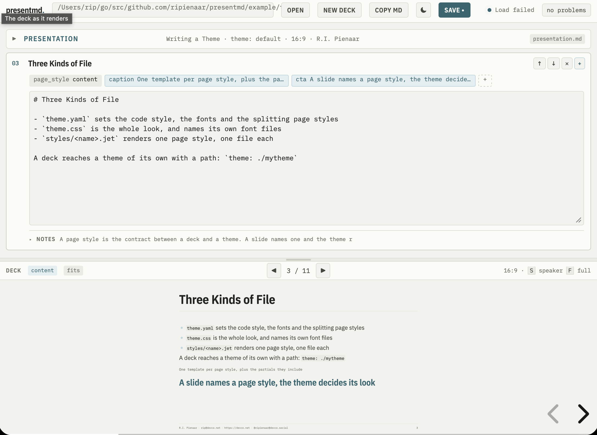

# presentmd

Slide decks written as markdown. A deck is a directory holding a
`presentation.yaml` and one markdown file per slide, or one `presentation.md`
carrying the whole talk. `presentmd` serves it on a local port and reloads the
browser as you write, writes the whole talk as one self contained HTML file that
opens from disk with no network, or opens [an editor](#the-editor) in the browser
with the deck itself rendering underneath.



Slides are [reveal.js](https://revealjs.com) underneath. Nothing is fetched at
runtime: reveal, the theme, its fonts and your images are all served by the
binary or inlined into the export.

## Install

Download the package for your machine from
[the releases page](https://github.com/ripienaar/presentmd/releases).

## The editor

```
presentmd edit mydeck
presentmd edit --root ~/talks ~/talks/mydeck
```

A page in two halves: the deck's settings and one panel per slide above, the
deck as reveal renders it below. A panel collapsed shows the slide's heading, its
page style and what else it sets; opened it shows a strip of the frontmatter it
carries, the markdown body, and the notes behind a fold. A key is added from the
`+` at the end of the strip and removed from the editor it opens in, so a slide
setting nothing shows nothing.

The deck below is not a drawing of the slides: every edit that settles is
written out as a presentation.md, read back through the loader and rendered
through the theme, so what is under the editor is the file a save writes and a
slide that runs past the footer says so before you stand in front of it.

`Save`, or `ctrl-s` and `cmd-s`, writes `presentation.md`. `Copy md` puts the same bytes on
the clipboard for a deck you would rather paste somewhere yourself. A file that
changed on disk since it was opened is reported rather than written over. The
presenter and the contacts are kept in a cookie in your own browser, so the next
talk starts with them filled in.

The top bar counts what is wrong with the deck and lists it: the same problems
`serve` prints, against the same files. Beside it, `☾` puts the editor's own
chrome into dark, which the deck below never follows: a slide is whatever its
theme makes it, on the projector and here.

Moving between slides moves both halves. The arrows over the deck walk it and
scroll the editor to that slide's panel, and clicking through the deck itself
moves the editor onto the slide you are looking at. Like the deck it renders, the editor fetches
nothing at runtime: its type is the theme's, served out of the binary.

### The root

Every file the editor reads and every file it writes goes through one
[os.Root](https://pkg.go.dev/os#Root). A path that climbs out of it, and a
symlink inside it that points out of it, are refused by the root rather than by a
check somebody has to remember.

The root is the deck directory, so an editor opened on a talk can write that talk
and nothing else. `--root` widens it to a directory of talks: every deck under it
opens from the `Open` menu, and `New deck` makes one there. Nothing else is
written either way: one `presentation.md` per deck, no images, no theme files.

The editor answers on the loopback address only, refuses a request that arrives
under any other host name, and every request its page makes carries a token that
is generated per run and written into the page. A page on another origin can post
to your machine; it cannot read the page that holds the token.

A deck written as `presentation.yaml` with a file per slide is refused rather
than opened, since the editor writes the single file form and a save would
otherwise leave two decks in one directory.

## Your first deck

A deck is a directory, written either as one file or as a file per slide.

### One file

`mydeck/presentation.md`, the presentation as frontmatter and a `+++` before
each slide:

```markdown
---
title: A Talk About Things
subtitle: And what they are for
theme: default
presenter:
  name: Alex
  surname: Rivera
contact_email: alex@example.net
---

+++
page_style: title
+++

+++
page_style: content
+++

# What They Are For

The body, as **markdown**.
```

### A file per slide

Two files in a directory:

```
mydeck/
  presentation.yaml
  01-title.md
```

`presentation.yaml`:

```yaml
title: A Talk About Things
subtitle: And what they are for
theme: default
presenter:
  name: Alex
  surname: Rivera
contact_email: alex@example.net
```

`01-title.md`:

```markdown
---
page_style: title
---
```

Then:

```
presentmd serve mydeck
```

A browser opens on the deck. Edit a slide and the page follows the change as you
save, whichever form the deck is written in.

There is a fuller deck of each form in [example](example), both with every page
style and every key in use: [example/presentation](example/presentation) is a
file per slide, [example/themes](example/themes) is one file.

```
presentmd serve example/presentation
presentmd serve example/themes
```

## Commands

```
presentmd serve [<flags>] <dir>
presentmd render [<flags>] <dir> <target>
presentmd edit [<flags>] <dir>
```

`serve` answers on `--listen`, `127.0.0.1:8080` by default, and opens a browser
unless `--no-open`. It watches the deck directory, and the theme's when the
theme is a directory, so a save re-renders. A port of 0 asks the kernel for a
free one, and `serve` does the same when the default port is already taken,
rather than failing. Problems with the deck are printed to the terminal and the slides that
loaded are still served, so a broken slide during a talk costs you that slide
rather than the talk.

`render` writes one HTML file with reveal, the theme, its fonts, the avatar and
every image inlined as data URIs. A deck with a loading or rendering problem
writes nothing and the command fails. What the export could not carry, an avatar
it could not fetch or a video background, is printed beside the file it did
write.

`--theme` on either loads that theme instead of the one `presentation.yaml`
names, as an embedded name or a path to a theme directory. A relative path is
read from the directory you type it in rather than from the deck, so a deck is
tried against a theme beside it without editing the deck:

```
presentmd serve --theme ./themes/choria example/presentation
```

`serve` keeps the override across a reload, so editing a slide does not put the
deck's own theme back. `PRESENTMD_THEME` sets it for a shell.

`edit` opens a browser editor over the deck, with the deck itself rendered
underneath it, and takes `--listen`, `--no-open` and `--theme` as `serve` does.
It is described in [the editor](#the-editor).

`--debug` raises the log level on any of them.

## Presenting

| Key     | What it does           |
|---------|------------------------|
| `S`     | the speaker view, with your notes and the next slide |
| `F`     | fullscreen             |
| `ESC`   | the slide overview     |
| `?`     | reveal's own help      |

The speaker view is a second window, so put it on the laptop screen and the deck
on the projector.

## presentation.yaml

| Key                | What it is                                                        |
|--------------------|-------------------------------------------------------------------|
| `title`            | the deck's title, and the title slide's text when it has no logo   |
| `subtitle`         | placed under the title                                             |
| `event`            | the conference, placed on the title slide                          |
| `date`             | placed beside the event                                            |
| `theme`            | required, `default` or a path to a theme directory                 |
| `aspect`           | a `W:H` ratio, `16:9` by default                                   |
| `footer`           | replaces the footer built from the presenter and the contacts      |
| `transition`       | `none`, `fade`, `slide`, `convex`, `concave` or `zoom`             |
| `transition_speed` | `default`, `fast` or `slow`                                        |
| `presenter`        | a block of `name`, `surname`, `avatar` and `github`                |
| `contact_email`    | placed in the footer and on the closing slide                      |
| `contact_web`      | placed in the footer and on the closing slide                      |
| `contact_web_label` | the label the closing slide shows `contact_web` under, `blog` by default |
| `contact_social`   | a handle, placed in the footer and on the closing slide            |
| `contact_social_network` | the network that handle is on, `Mastodon`, `Bluesky`, and the label the closing slide shows it under |

`theme` is required because reveal applies one theme stylesheet to the whole
deck. A deck that names no theme gets a problem printed against
`presentation.yaml` rather than a theme nobody chose.

The presenter's `avatar` is a path in the deck directory. Naming a `github`
handle instead builds the avatar URL from it, which means an export has to fetch
it once.

`contact_social_network` is the label the closing slide shows `contact_social`
under, so write it the way you want it read. A handle with no network is labeled
`social`. `contact_web_label` does the same for `contact_web`, for an address
that is a homepage or a docs site rather than a blog, and one with no label is
labeled `blog`.

`footer` replaces the line otherwise built from the presenter's name and the
three contacts. Set one or the other, not both: a deck with a `footer` never
shows the derived line, though the contacts still reach the closing slide.

## Slides

A slide is yaml frontmatter and a markdown body. Where it lives depends on the
form the deck is written in:

- **One file.** `presentation.md` opens with the presentation's own frontmatter,
  then a `+++` opens each slide and closes that slide's frontmatter. Order in the
  file is the order of the talk.
- **A file per slide.** One slide per `.md` file, named with a leading number
  that sets the order: `01-title.md`, `02-what-it-is.md`. The frontmatter is
  fenced with `---` as usual, and `slide:` overrides the number for a file whose
  name should not carry one.

A directory holding `presentation.md` is read that way and the markdown beside it
is not searched for slides, so a deck is written one way or the other rather than
both. The frontmatter is the same either way:

| Key           | What it is                                                     |
|---------------|----------------------------------------------------------------|
| `page_style`  | required, the template the theme renders this slide with       |
| `caption`     | a line under the body                                          |
| `cta`         | a call to action under the caption                             |
| `notes`       | what the speaker view shows you and the audience never sees    |
| `background`  | a hex value, a CSS color name, or a path to an image           |
| `transition`  | this slide's own move, over the deck's                         |
| `text_size`   | `small`, `normal`, `large` or `huge`                           |

The body's first level one heading is the slide's heading and the rest is the
content. The theme places the presenter, the contacts and the footer, so no
slide writes them.

`+++` is the slide break rather than `---` because a `---` inside a body already
means two things: a thematic break, and the division between the halves of a
[two column](#two-columns) slide. A `+++` inside a fenced code block is the
deck's own text and does not end the slide.

`text_size` moves that slide's body and its code together, while the heading,
the caption and the footer stay where the theme puts them on every slide. Reach
for it when a slide carries more than the rest and would otherwise run past the
footer, or when it carries one line that deserves the room.

### Page styles

The shipped theme offers seven, and a directory theme offers whatever templates
it holds:

| `page_style` | What it is                                                    |
|--------------|---------------------------------------------------------------|
| `title`      | the opening slide: logo, title, subtitle, event, avatar, presenter |
| `section`    | a divider carrying a heading alone                            |
| `content`    | a heading and a body, the ordinary slide                      |
| `columns`    | a body divided into two columns                               |
| `code`       | a slide built around a fenced code block                      |
| `image`      | a slide built around one picture                              |
| `closing`    | the questions slide, which lists the contacts                 |

On the `title` slide the body is the logo, so a slide whose whole body is one
image gets the image; a title slide with no body shows the deck's `title`.

### Two columns

A `---` on a line of its own divides the body of a slide whose page style the
theme splits, which for the shipped theme is `columns` alone. What is above the
break is the left column and what is below it is the right:

```markdown
---
page_style: columns
---

# Who Writes What

The slide

- Its heading and body
- A caption and a call to action

---

The theme

- Type, color and spacing
- Where each of those lands
```

In every other page style a `---` is a horizontal rule. A second break in a
splitting slide is reported as a problem against that slide.

### Markdown

Ordinary markdown: headings, lists, tables, blockquotes, links, emphasis, inline
code and fenced code. Fenced code is highlighted with the style the theme names.
Images point at files in the deck directory, `images/thing.svg`, and are served
from there or inlined into an export.

## Themes

One theme ships in the binary, named `default`: a light ground, teal accent and
IBM Plex, with its font files carried inside so a deck looks the same on a
machine that has never installed them. It is the only value `theme` takes unless
you point at a directory of your own.

A `theme` holding a path separator is a directory rather than a name:
`./deck-theme` beside the deck, or an absolute path. A directory theme is
watched along with the deck, so editing its CSS reloads the browser.

A theme is a directory of:

- `theme.yaml` — `code_style`, the chroma style fenced code is highlighted with;
  `split_styles`, the page styles a `---` divides; `fonts`, the three stacks the
  stylesheet reads; and `transition`, the theme's own move, which a deck overrides.
- `theme.css` — the whole look. Font files it names with `url()` are served from
  the theme directory and inlined into an export.
- `styles/<name>.jet` — one [jet](https://github.com/CloudyKit/jet) template per
  page style, plus partials like `_footer.jet` that the others include.

To write one, start from `present/themes/default/` in this repository and change
what you want. A template is handed `heading`, `body`, `left`, `right`,
`caption`, `cta`, `avatar`, `presenter`, `footer`, `contacts`, `presentation`
and `slide`.

## Claude Code skills

Two skills for [Claude Code](https://claude.com/claude-code) ship as the
`presentmd` plugin, one for writing a deck and one for writing a theme. Install
them with:

```
/plugin marketplace add choria-io/agent-plugins
/plugin install presentmd@choria
```

`/presentmd:presentation` builds a deck. It asks about the talk, the audience,
how many minutes you have on stage, and the name, event and contacts a slide
carries, then writes `presentation.yaml` and one markdown file per slide into a
deck directory and renders it to check that every slide fits. It also takes a
deck that already exists, to add slides to it or to restructure one.

`/presentmd:theme` builds a theme. It asks what the talk should feel like, which
ground and accent color, which fonts and what belongs on every slide, then
writes `theme.yaml`, `theme.css` and the templates, renders a deck through them
and looks at the slides.

Both are also picked up on their own: asking for a deck, a talk, some slides, or
for your brand colors on a presentation, reaches them without typing a name.

Either skill can take the notes, README or design document you already have as
the thing to turn into slides:

```
/presentmd:presentation turn DESIGN.md into a 20 minute talk for a team review
```

## Live reload

A page being served listens for a change and does the smallest thing that shows
it:

- a slide's text changed: that slide's contents are swapped in place, so the
  deck does not reload and you stay on the slide you are looking at
- a slide was added, removed, reordered, or changed its page style or
  background: the slides are written again and reveal reads the deck back
- the theme, the aspect, the transition or an image changed: the page reloads,
  since a stylesheet or a slide size cannot be handed to a reveal that is
  already running

A save that leaves `presentation.yaml` half written keeps the page that is
already showing and prints what was wrong, so a file caught mid-keystroke does
not blank the slide you are standing in front of.

The editor's preview rides the same stream: a keystroke that settles is rendered
and the frame under the editor follows it, without anything being written to
disk.

## License

reveal.js is bundled under its own MIT license, see `present/reveal/LICENSE`.
The IBM Plex font files the theme carries are under the SIL Open Font License.
